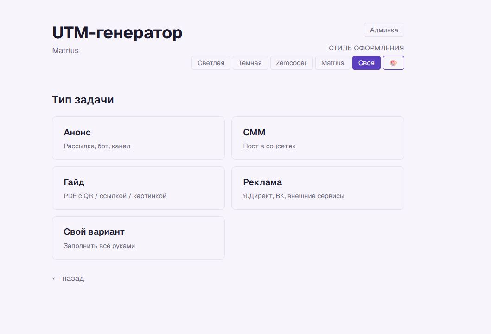
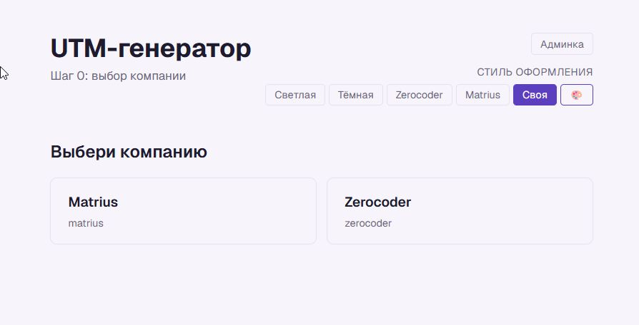
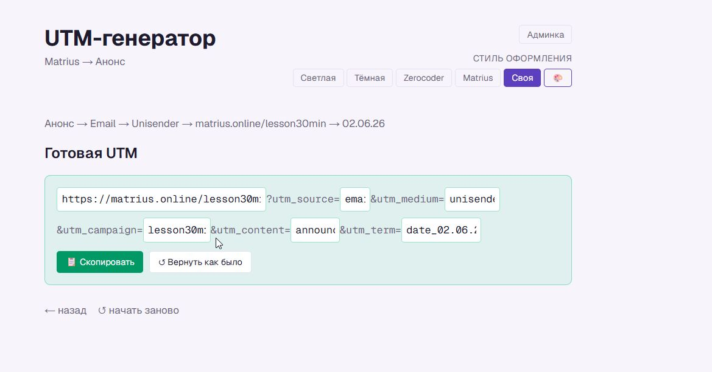
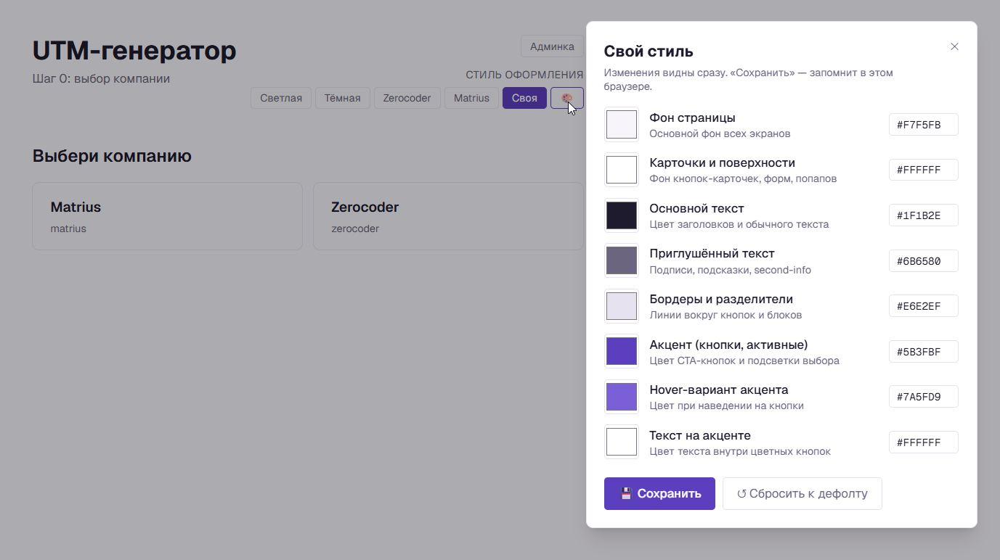
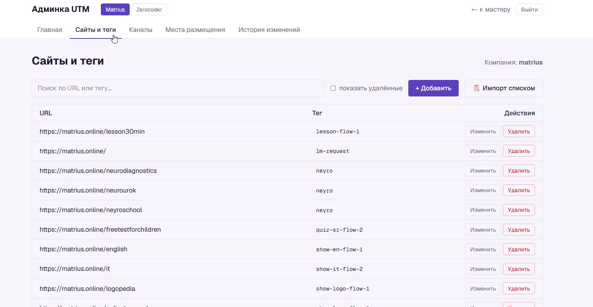

# UTM Generator

Пошаговый мастер для сборки UTM-меток по правилам компании. Два бренда в одном приложении — Matrius и Zerocoder.

**Деплой:** [utm-matrius.vercel.app](https://utm-matrius.vercel.app)

## Возможности

- **Пошаговый мастер** — выбираешь компанию → тип задачи → платформу/канал → сайт → дату, получаешь готовую UTM-ссылку
- **Две компании** — Matrius и Zerocoder, у каждой свой набор каналов и логика формирования меток
- **9 типов задач** — Анонс, СММ, Гайд, Реклама, Воронка вебинара, Внешние выступления, Блог, Геткурс, Свой вариант
- **Ручной режим** — если нужна метка без привязки к настроенным справочникам
- **Редактор «паровозик»** — финальную UTM-строку можно поправить прямо в браузере до копирования
- **5 тем оформления** — светлая, тёмная, Zerocoder, Matrius, своя (с редактором цветов)
- **Админка** — управление сайтами, каналами, местами размещения
- **Массовый импорт** — загрузка сайтов с тегами из TSV/CSV
- **Журнал изменений** — аудит всех действий с возможностью отката

## Скриншоты

<p align="center">
  
  <br><em>Главная — выбор компании и типа задачи</em>
</p>

<p align="center">
  
  <br><em>Выбор компании</em>
</p>

<p align="center">
  
  <br><em>Редактор «паровозик» — финальную ссылку можно поправить в браузере</em>
</p>

<p align="center">
  
  <br><em>Редактор своей темы оформления</em>
</p>

<p align="center">
  
  <br><em>Админка — управление справочниками</em>
</p>

## Стек

- **Next.js 16** (App Router)
- **React 19**
- **TypeScript**
- **Tailwind CSS 4**
- **Turso** (облачный SQLite, libsql)
- **Vercel** — деплой

## Запуск локально

```bash
npm install
cp .env.local.example .env.local  # заполни DATABASE_URL и ADMIN_SESSION_TOKEN
npm run dev                        # http://localhost:3000
```

### Управление БД

```bash
npm run db:migrate  # применить схему
npm run db:seed     # наполнить тестовыми данными
```

## Структура проекта

```
src/
├── app/
│   ├── admin/       # админка (сайты, каналы, размещения, история)
│   ├── api/         # API-маршруты
│   ├── login/       # страница входа
│   ├── layout.tsx
│   ├── page.tsx     # главная — точка входа в мастер
│   └── globals.css  # CSS-переменные тем
├── components/
│   ├── admin/       # компоненты админки
│   ├── Wizard.tsx   # корневой мастер
│   ├── Branch*.tsx  # ветки под типы задач
│   ├── EditableUtm.tsx  # редактор UTM-строки
│   └── ...прочие
├── db/              # клиент, запросы, схема
└── lib/             # утилиты: UTM, авторизация, аудит
```

## Лицензия

MIT
